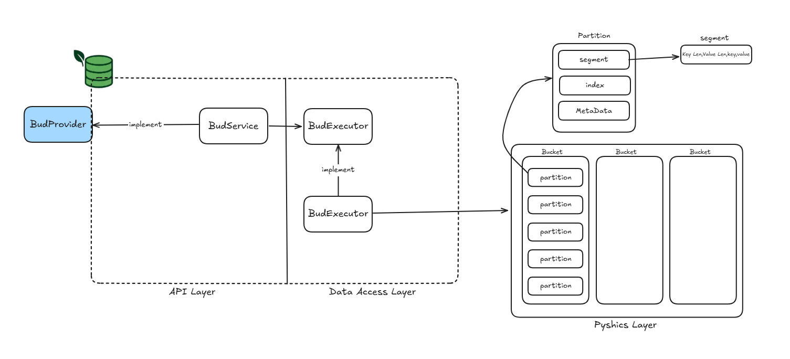

## BuDB Core 도메인

* 사용자는 해당 DB에 **저장 DIR**을 설정할 수 있다.
* `{key:data}` 형식으로 로컬 영역에 저장한다.
* 데이터는 **Bucket** 단위로 관리되며, 버킷마다 **세그먼트 파일**, **인덱스 파일**, **메타데이터 파일**이 생성된다.

---

## 도메인 모델

### BudProvider

***interface (port)***

#### 행위

* **createBucket** : 새로운 Bucket을 생성한다.
* **deleteBucket** : 기존 Bucket을 삭제한다.
* **save** : 지정된 key로 데이터를 저장한다.
* **get** : 지정된 key에 해당하는 데이터를 가져온다.

---

### BudExecutor

***interface (core)***

#### 행위

* **isExistBucket** : Bucket 존재 여부를 확인한다.
* **createBucket** : 새로운 Bucket을 생성한다. (세그먼트/인덱스/메타데이터 파일 포함)
* **deleteBucket** : Bucket을 삭제한다.
* **put** : `{key:value}` 데이터를 저장한다. (현재는 파일 단위 저장, 향후 세그먼트 구조로 리팩토링 예정)
* **get** : 지정된 key에 해당하는 데이터를 가져온다.

---

### BudEngine

***구현체 (executor)***

#### 역할

* `BudExecutor` 인터페이스 구현.
* Bucket 생성 시 세그먼트/인덱스/메타데이터 파일 초기화.
* LockRegistry 기반으로 버킷 단위 동시성 제어.
* 현재는 단일 파일 저장(`put/get`), 추후 세그먼트 단위 저장 구조로 확장 예정.

---

### BudService

***서비스 (adapter)***

#### 역할

* `BudProvider` 인터페이스 구현.
* 외부에서 사용하는 진입점 역할 (API, 클라이언트 등).
* 내부적으로 `BudExecutor`를 호출해 실제 동작 수행.

